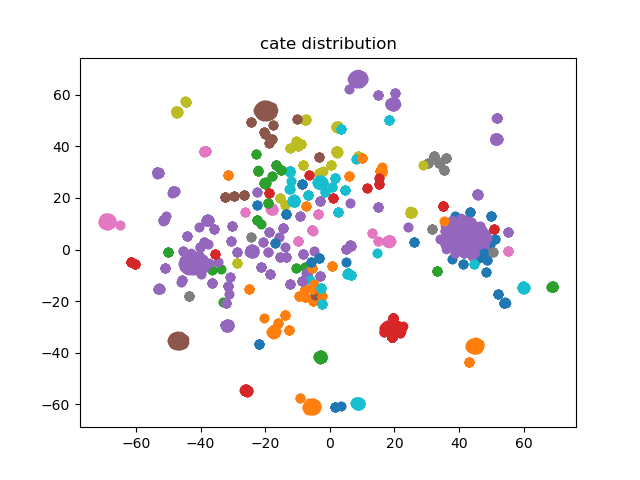

# EGES-PIPLINE
implemention od Alibaba's paper: [Billion-scale Commodity Embedding for E-commerce Recommendation in Alibaba](https://arxiv.org/abs/1803.02349)

一个EGES的pipeline简单实现，包括以下部分：
* 数据获取：使用[jdata2019](https://wx.jdcloud.com/market/jdata/list/17)比赛中的行为数据（10000条），及商品数据。
* 从user behaviour history 构建session，session截断依据为最后一个action为下单，或者30分钟内没有action
参考[Airbnb Real-time Embedding](https://www.kdd.org/kdd2018/accepted-papers/view/real-time-personalization-using-embeddings-for-search-ranking-at-airbnb)
* 根据session list构图，基于node2vec游走采样重新生成session，并加载item对应side info
* EGES实现，基于word2vec改写
* 生成embedding并可视化

较为完整的复现了工业界常用的graph embedding pipeline。

## node2vec代码参考
* code: https://github.com/shenweichen/GraphEmbedding
* author: shenweichen

## 环境配置
* python 3.6.5
* tensorflow == 1.14.0
* joblib
* networkx

## baseline示例：
```
python EGES.py
```

## Embedding可视化
品类数据：


